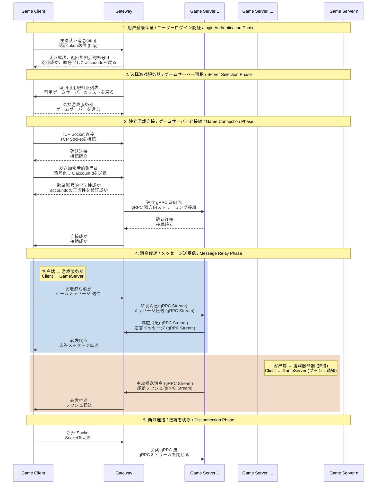

# Wand Sword Saga - Game Server

## 概要 / Overview

これはRubyとRuby on Railsを勉強するための個人的なゲームサーバープロジェクトです。  
这是一个为了学习Ruby和Ruby on Rails的个人游戏服务端项目。

> **Note** 
> これは初めて日本語でコメントするプロジェクトです。 表現がうまく伝わっているか心配な時は中国語と日本語の2つの言語でコメントします。  
> 这是我第一次尝试使用日语注释的项目。担心表达不准确的时候，我会使用中日双语注释。
> 
## 想实现的架构 / 実現したいアーキテクチャ / Architecture

## ライセンス / License

このプロジェクトは個人学習用です。 
此项目仅供个人学习使用。