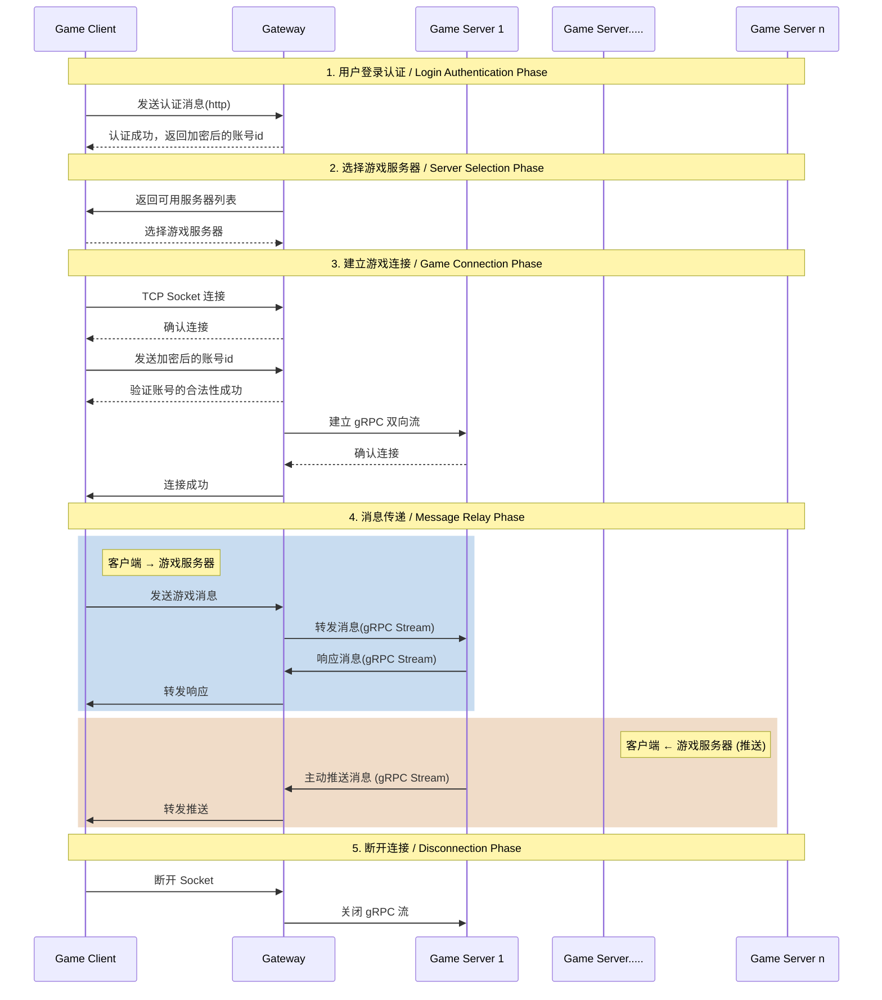

# Wand Sword Saga - Game Server

## 概要 / Overview

这是一个为了学习Ruby和Ruby on Rails的个人游戏服务端项目。

> **Note**
> 这是我第一次尝试使用日语注释的项目。担心表达不准确的时候，我会使用中日双语注释。

## パッケージ説明 / 包说明
*   **`game_server/`**: 游戏核心功能
*   **`gateway/`**: 账号校验和验证转发客户端的消息
*   **`protos/`**: game_server和gateway公用的协议和生成脚本

## 想实现的架构 / Architecture

## ライセンス / License

此项目仅供个人学习使用。
