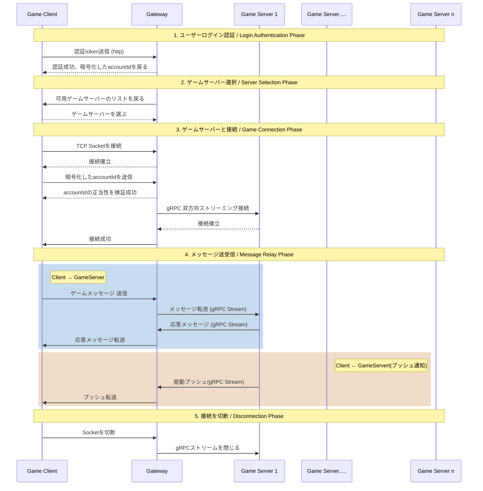

# Wand Sword Saga - Game Server

## 概要

これはRubyとRuby on Railsを勉強するための個人的なゲームサーバープロジェクトです。

> **Note**
> これは初めて日本語でコメントするプロジェクトです。 表現がうまく伝わっているか心配な時は中国語と日本語の2つの言語でコメントします。

## パッケージ説明
*   **`game_server/`**: ゲームのコア機能実現
*   **`gateway/`**: ログイン認証とクライアントメッセージの検証・転送
*   **`protos/`**: game_serverとgateway公用のプロトコル＆生成スクリプト

## アーキテクチャ

## ライセンス

このプロジェクトは個人学習用です。
